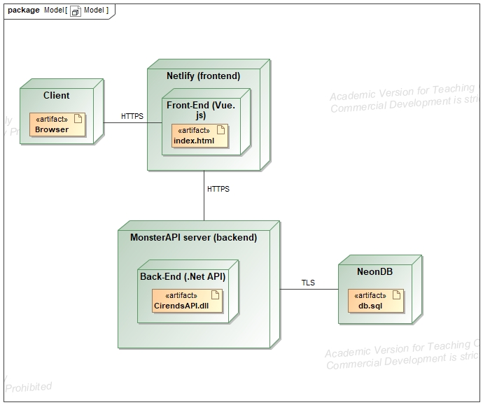
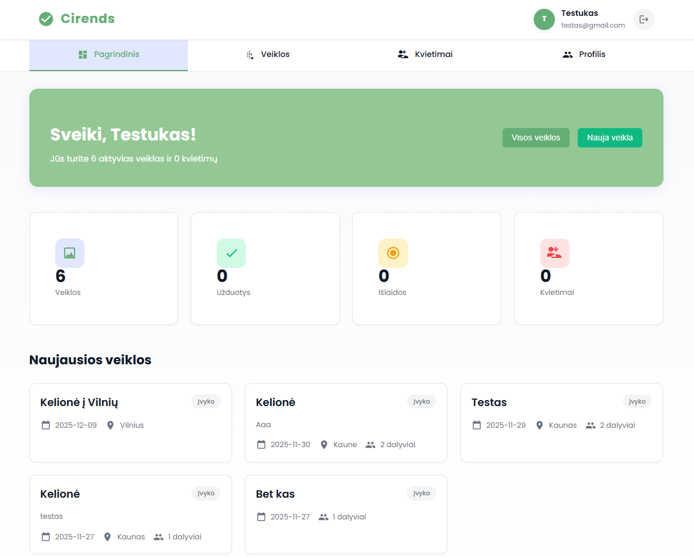
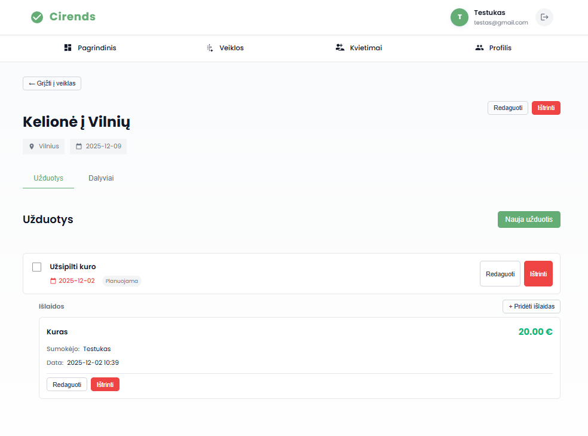

# Cirends

## 1. Tikslas

**Projekto tikslas** – sukurti planavimo sistemą, kuri palengvintų draugų ar bendraminčių grupių bendrų veiklų organizavimą, suteikiant galimybę patogiai planuoti veiklas, paskirstyti užduotis ir sekti finansus.

**Veikimo principas** – sistema sudaryta iš dviejų dalių:
- **Internetinė aplikacija**, kuria naudosis paprasti naudotojai ir administratorius;
- **API sąsaja**, užtikrinanti veiklų, užduočių ir išlaidų valdymą bei duomenų mainus tarp kliento ir serverio.

Naudotojas, prisijungęs prie aplikacijos, galės:
- kurti veiklas (pvz., „Kelionė prie ežero“),  
- priskirti užduotis (pvz., „Nupirkti maisto“, „Surinkti žmones“),  
- pridėti susijusias išlaidas (pvz., „Degalai – 50 €“).  

Sistema leis paskirstyti atsakomybę, matyti, kas ką padarė, ir kaip pasidalintos išlaidos.

---

## 1.1 Sistemos paskirtis

Sistemos paskirtis – palengvinti naudotojų bendravimą ir organizavimą, leidžiant jiems efektyviai:
- planuoti veiklas,  
- dalintis atsakomybėmis,  
- valdyti išlaidas.  

Sistema suteiks galimybę naudotojams bendrauti, dalintis informacija ir užtikrinti, kad visi dalyviai būtų informuoti apie planuojamas veiklas.

---

## 1.2 Funkciniai reikalavimai

### Neregistruotas naudotojas (Svečias) galės:
1. Peržiūrėti reprezentacinį puslapį apie projektą („Cirends“ aprašymas, funkcijos).  
2. Užsiregistruoti sistemoje.  
3. Prisijungti prie sistemos.  

### Registruotas naudotojas (Narys) galės:
1. Atsijungti nuo sistemos.  
2. Kurti naują veiklą (pvz., „Kelionė į kalnus“).  
3. Redaguoti savo sukurtą veiklą.  
4. Šalinti savo sukurtą veiklą.  
5. Peržiūrėti savo veiklų sąrašą.  
6. Pakviesti kitus naudotojus dalyvauti veikloje.  
7. Patvirtinti ar atmesti pakvietimą į veiklą.  
8. Pridėti užduotis prie veiklos (pvz., „Nupirkti maisto“).  
9. Priskirti atsakingą naudotoją prie užduoties.  
10. Nustatyti užduoties terminą.  
11. Keisti užduoties būseną (planuojama → vykdoma → atlikta).  
12. Peržiūrėti veiklai priskirtų užduočių sąrašą.  
13. Pridėti išlaidas prie veiklos ar užduoties (pvz., „Benzinas – 50 €“).  
14. Nurodyti, kas sumokėjo už išlaidas.  
15. Paskirstyti išlaidas tarp dalyvių (lygiai arba procentiškai).  
16. Peržiūrėti bendrą išlaidų suvestinę veikloje.  
17. Matyti individualią savo skolą ar permoką.  

### Administratorius galės:
1. Peržiūrėti visų sistemos naudotojų sąrašą.  
2. Šalinti naudotojus.  
3. Valdyti sistemos prieigos teises.  

---

## 2. Sistemos architektūra

### Deployment diagrama

Frontend talpinamas Netlify, backend – MonsterAPI, DB – NeonDB (PostgreSQL).

- **Kliento pusė (Front-End):** HTML, CSS, Vue.js  
- **Serverio pusė (Back-End):** C# su .NET  
- **Duomenų bazė:** NeonDB (PostgreSQL)
- **Debesų technologijos:** MonsterAPI (backend talpinimui), Netlify (frontend talpinimui) 

## 3. Naudotojo sąsajos projektas

### Main page

### Activity detail page

### 4. Pagrindiniai endpoint'ai:

[API specifikaciją (api-spec.yaml)](api-spec.yaml)

#### Autentifikacija:
- `POST /api/auth/register` - Registracija
- `POST /api/auth/login` - Prisijungimas
- `POST /api/auth/logout` - Atsijungimas

#### Veiklos:
- `GET /api/activities` - Gauti visas naudotojo veiklas
- `POST /api/activities` - Sukurti naują veiklą
- `GET /api/activities/{id}` - Gauti konkrečios veiklos detales
- `PUT /api/activities/{id}` - Atnaujinti veiklą
- `DELETE /api/activities/{id}` - Ištrinti veiklą

#### Užduotys:
- `GET /api/activities/{activityId}/tasks` - Gauti veiklos užduotis
- `POST /api/activities/{activityId}/tasks` - Sukurti naują užduotį
- `PUT /api/tasks/{id}` - Atnaujinti užduotį
- `DELETE /api/tasks/{id}` - Ištrinti užduotį

#### Išlaidos:
- `GET /api/activities/{activityId}/expenses` - Gauti veiklos išlaidas
- `POST /api/activities/{activityId}/expenses` - Sukurti naują išlaidą
- `PUT /api/expenses/{id}` - Atnaujinti išlaidą
- `DELETE /api/expenses/{id}` - Ištrinti išlaidą

### 5. Išvados
Projekto „Cirends“ tikslą - sukurti patogią ir funkcionalią planavimo sistemą, kuri padėtų draugų ar bendraminčių grupėms efektyviai organizuoti bendras veiklas, iš dalies pavyko pavyko įgyvendinti ir sistema leidžia naudotojams lengvai kurti veiklas, priskirti užduotis bei valdyti išlaidas, taip palengvinant bendravimą ir atsakomybės pasidalijimą. Modernių technologijų naudojimas, tokias kaip Vue.js, .NET ir NeonDB (PostgreSQL), užtikrina sklandų sistemos veikimą. Puslapis veikia ir yra patalpintas internete, todėl naudotojai gali lengvai pasiekti ir naudotis sistema jau dabar.